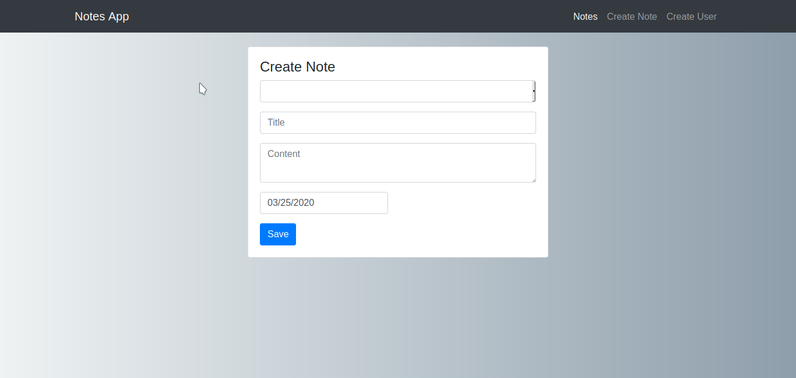

# STACK MERN

## Notes app
---

### Notes app screenshot

---

> Bug

* [ ] If there is not exist user, an error will be created when creating a new note, since it uses as an option a list of users for the author.